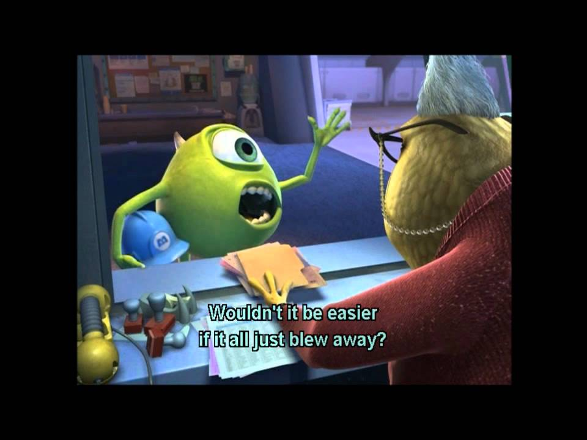

# Healthy Programmer

.center[]

???
Couple of shout-outs before i start...

"Read this book so you don't die in your chair."

HT: @sara - http://33.media.tumblr.com/3a67e4ea496cbad39b23bf48e046c810/tumblr_nasiplAH851qhu3vxo1_500.gif

TODO: include this Dilbert? :
https://pbs.twimg.com/media/B9oQwNrIYAAqrw8.jpg

---

# Depression

<!-- .center[] -->
.center.three-big[http://devpressed.com]
.center.three-big[http://blog.baugues.com/depression]
.center.three-big[Greg Baugues]

???

Devpressed support forum. I myself don't suffer from depression but my wife does.

If you or someone you know also suffers with it, or you'd just like to learn more about it, it's a good resource.

---

# TITLE SLIDE

  

.center[# Estimates]

???
Today's talk is on estimates, but “first, some general facts."
---

layout: true
class: center, top

---

# Yeah

.center.one-big[The Romans were _incredible_.]

---

# ... ok ...

.center.one-big[Democracies are just the _greatest_.]

---

# ... but ...

.center.one-big[Julius Caeser _fit_ the society he lived in.]

---

# What Does That Mean?!

 
.left.big-para[
<ul>
  <li>The Romans were ... <i>unlikely?</i></li>
  <li>Democracies are the greatest ... <i>disaster in history?</i></li>
  <li>Caeser ... <i>had the proper physical dimensions?</i></li>
</ul>    ]

   

<i>Utah State prof Mark Damen Writing Guide
http://www.usu.edu/markdamen/WritingGuide/04nonsta.htm</i>

???
These wonderful examples of WTF are brought to us by professor Mark Damen in his writing guide, where he
goes on to explain:

"[Words] used imprecisely, leave a reader puzzled about what the writer means. If I'm unable to follow your paper
because I don't know what you mean, how can I evaluate the quality of your thinking or assess your efforts?"

Indeed, sound questions Professor.

Here's a sentence that is probably more familiar to most of us.

---

layout: false
class: center, middle

## I'm _*90% sure*_ we'll be done on time.

???
Does this mean that I've calculated the odds that going ...

---

layout: true
class: center, top

---

# Obligatory Comic

.center[]

http://xkcd.com/630/
???
... back in time 10 times, I know we'll have success
9 times? Now, _probably_ ... that's just me choosing to be difficult ...

---

# Don't Be Such a Dork

.center[]

???
We can all be reasonable and guess at what's really intended by these types of estimates. What does it matter?

---

# Specific Things are Specific

.center[]

  

Kathy Sierra
http://headrush.typepad.com/creating_passionate_users/2006/12/dont_make_the_d.html

???
Kathy Sierra in a 2006 post called “Don't make the Demo Look Done" talks about the impact
on feedback the quality of a mockup can have. A mockup that looks finished tends to illicit
more specific (and less useful) feedback.

---

# Specific Things are Specific

.center[]

  

Kathy Sierra
http://headrush.typepad.com/creating_passionate_users/2006/12/dont_make_the_d.html

???
Where a rough mockup tends to spur feedback at a higher and more helpful level.

---

layout: true
class: center, middle

---

# Vague Estimates are Vague
???
So when we apply this to estimates... which should be vague, based on guesses, hunches and experience

---

# Specific Numbers are Specific
???
and we add numbers, numbers bring an undue level of specificity SPES-EH-FIC-EH-TEE

If we start talking numbers we frequently start debating numbers. So what I say is

---

# No Numbers Estimates
???
Get rid of the numbers.
---

layout: false
class: center, top

# One or More

.center[
<table align="center" cellpadding="60px">
<tr><td class="one-big"><i>Hours</i></td><td class="one-big"><i>Days</i></td>
<tr><td class="one-big"><i>Weeks</i></td><td class="one-big"><i>Months</i></td>
</table>        ]

???
If I limit myself to these four words,
If all I say is 'hours' or 'days' or maybe 'hours-to-days' then the discussion can stay at an appropriate level
for estimates, rather than presuming we know more than we do.

---

layout: true
class: center, middle

---

# Now + _Days_ = Jan 30th

???
And if anyone tries to do the math, it might be clearer that they're doing something fishy.

---

.center[]
???

---

layout: true
class: center, top

---

# Paging Hippy-Dreamer

.center.one-big[Real World Uses Numbers, Yo]

---

# Why?

.center.one-big[Because Contracts]

???
Kerry Lenahan
---

# Why?

.center.one-big[Because Accountability]

---

# Why?

.center.one-big[Because Trust]

---

class: center, middle

# Fortune Telling ≠ Trust
???
When did Fortune Telling become a valid tool for establishing trust?

---

class: center, top

# Ron Jeffries

.center.one-big[“Estimates Are Evil"]

  

https://pragprog.com/magazines/2013-02/estimation-is-evil

???
In 2013 Ron Jeffries, one of the 3 founders of XP, one of the original agile methodologies, wrote this article
for the prag prog online magazine.

He says,
“One of the best-known long-term Agile projects was Chrysler’s C3 payroll, the first Extreme Programming project.

I was once present for an exchange between Sue Unger, then CIO of Chrysler Corporation, and Kent Beck.
 Kent had just explained how we’d be working and Ms. Unger asked “How will I know whether you’re on track or not?”
 Kent said, “We ask you to visit us every month. We’ll show you [our task] cards, and show you how many are done and
 how many are left to do. If you’re not satisfied with the progress, cancel the project.”

Sue, said, “I can do that.”

So we can see a de-emphasis of estimates from the get-go.

---

# XP 1st Edition

 
 
# Load Factor

  

_see also http://guide.agilealliance.org/guide/velocity.html_
???
But if you're saying what about Story Points, well it's an interesting progression. In fact, the 1st edition of
XP Explained had this concept of Load Factor, which was a value you could factor into your task estimates to try
and determine the translation of ideal time to real time...
---

# XP 2nd Edition

 
# Story Points
# Yesterday's Weather

  

_see also http://guide.agilealliance.org/guide/velocity.html_
???
Which was softened to be merely Story Points in the 2nd edition when many teams realized the effort of
figuring out Load Factor didn't pay for itself, and the notion of Yesterday's Weather started to take hold.

Why invest in an expensive computer model when all you really need to know is if there's some chance today
a tornado might rip my house off its foundation

---

class: center, top

# “Estimates Are Evil"

.center.one-big[_I may actually have invented Points. If I did, I’m sorry now._]

.center.four-big[Ron Jeffries]

???
And the progression even goes further because
---

layout: true
class: center, middle

---

# Numbers
???
Because numbers are

---

# Guesses
???
Guesses based on

---

.center[]
???
Imagination, therefore
---

# ``¯\_(ツ)_/¯``

---

layout: true
class: center, middle

---

# Story Time

???
Restricted deal bucks.

Things are going well.

Cassandra asks how it's going.

I say well,

She asks, how confident
---

# 90%?

???
But I decided to turn it around and I asked her
---

# If 10% Happens ... Then What?

???
If I said 90%, but the 10% happens, then what?

She said in that case they'd just want to shut down RaF over the holiday weekend.

And from that point on, the numbers just ... [next] - went away.

    

She said that wouldn't be hard to do and we negotiated a contingency that if something
didn't fall into place, we could yank it out.

Even the night before, we were mostly ready, but I knew only one unplanned for thing
had to go wrong to derail the whole thing. But it was fine. Things weren't tense, we knew
this was how it could go, and even though it did work out, if we'd needed to pull the plug,
it would have been fine.

Most important to my talk here though, is I never had to give a number.
---

.center[]

???
And why is that? Because I believe when you have other things in play,
---

# Contingency

---

# Communication

---

# Transparency

---

# Managing Expectations

???
Not only are these things _greater_ than numbers, put together
---

# Contingency
# Communication
# Transparency
# Managing Expectations

???
numbers don't even need to enter into the conversation.

Now, to be clear, I'm not saying never provide estimates. People on the business side of the equation
do have resource constraints and do need to understand what sort of effort and risks they're undertaking
as best as we know.

And many may be thinking, hey, numbers are fine and maybe frequently you know pretty accurately how
to put a number on something.

But the bottom line for me is expressed in this quote:

---

# **Never give an answer with more precision than warranted.**

### _Don Norman, Professor of Computer Science, Northwestern University_

.center.two-big[http://clabs.org/blog/DesignPrecision]

???
READ IT

That's the talk. You can go to my blog and get a the background on that quote as well as links to other related
thoughts on the subject. I'd love y'all's feedback. Happy Trails, and while Tyler closes us out ... Juggling!

Juggling!!
