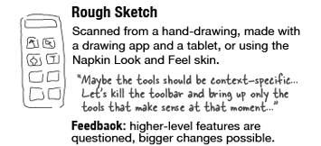

# Healthy Programmer

.center[]

---

# Depression

.center.one-big[Greg Baugues http://blog.baugues.com/depression]

---

layout: false
class: center, middle

# Vague Estimates are ... well ...

???
Today's talk is on estimates, but first, some general facts.
---

layout: true
class: center, top

---

# Yeah,

.center.one-big[The Romans were _incredible_.]

---

# ... ok ...

.center.one-big[Democracies are just the _greatest_.]

---

# ... but ...

.center.one-big[Julius Caeser _fit_ the society he lived in.]

---

# What Does That Mean?!

.left.big-para[
<ul>
  <li>The Romans were ... <i>beyond belief</i>?</li>
  <li>Democracies are the greatest ... <i>disaster in history</i>?</li>
  <li>Caeser ... <i>had the proper physical dimensions</i>?</li>
</ul>    ]

   

-- <i>Utah State prof Mark Damen, http://www.usu.edu/markdamen/WritingGuide/04nonsta.htm</i>

???
HT: to Utah State Univ. prof Mark Damen for the examples.

---

layout: false
class: center, middle

## I'm _*90% sure*_ we'll be done on time.

???
Does this mean that I've calculated the odds that going back in time 10 times, I know we'll have success
9 times?

---

layout: true
class: center, top

---

# 90% Sure

.center[]

http://xkcd.com/630/

---

# Don't Be Such a Dork

.center[]

???
We can all be reasonable and guess at what's really intended by these statements. Does this matter?

---

# Specific Things are Specific

.center[]

  

Kathy Sierra, http://headrush.typepad.com/creating_passionate_users/2006/12/dont_make_the_d.html

???
Kathy Sierra in a 2006 post called "Don't make the Demo Look Done" talks about the impact
on feedback the quality of a mockup can have. A mockup that looks finished tends to illicit
more specific (and less useful) feedback.

---

# Specific Things are Specific

.center[]

  

Kathy Sierra, http://headrush.typepad.com/creating_passionate_users/2006/12/dont_make_the_d.html

???
Where a rough mockup tends to spur feedback at a higher and more helpful level.

---

layout: true
class: center, middle

---

# Vague Estimates are Vague
???
So when we apply this to estimates... which should be vague, based on guesses, hunches and experience

---

# Specific Numbers are Specific
???
but numbers bring an undue level of specificity

---

# No Numbers Estimates
???
If we start talking numbers, then we start debating numbers....
---

layout: false
class: center, top

# One or More

.center[
<table align="center" cellpadding="60px">
<tr><td class="one-big"><i>Hours</i></td><td class="one-big"><i>Days</i></td>
<tr><td class="one-big"><i>Weeks</i></td><td class="one-big"><i>Months</i></td>
</table>        ]

???
If all I say is 'days' then the debate can stay in the realm of 'hours' vs 'days' without any specifics getting
in the way.

---

layout: true
class: center, middle

---

# Now + _Days_ = Jan 30th

???
And if anyone wants to do the math, it might be clearer that they're doing something fishy.

---

.center[]
???

---

layout: true
class: center, top

---

# Paging Hippy-Dreamer

.center.one-big[Real World Uses Numbers, Yo]

---

# Why?

.center.one-big[Because Contracts]

---

# Why?

.center.one-big[Because Accountability]

---

# Why?

.center.one-big[Because Trust]

---

class: center, middle

# Fortune Telling ≠ Trust

---

class: center, top

# Ron Jeffries

.center.one-big["Estimates Are Evil"]

  

https://pragprog.com/magazines/2013-02/estimation-is-evil

???
One of the best-known long-term Agile projects was Chrysler’s C3 payroll, the first Extreme Programming project.

I was once present for an exchange between Sue Unger, then CIO of Chrysler Corporation, and Kent Beck.
 Kent had just explained how we’d be working and Ms. Unger asked “How will I know whether you’re on track or not?”
 Kent said, “We ask you to visit us every month. We’ll show you [our task] cards, and show you how many are done and
 how many are left to do. If you’re not satisfied with the progress, cancel the project.”

Sue, said, “I can do that.”

---

# XP 1st Edition

.center.one-big[Load Factor]

  

_see also http://guide.agilealliance.org/guide/velocity.html_
---

# XP 2nd Edition

.center.two-big[Story Points]
.center.two-big[Yesterday's Weather]

  

_see also http://guide.agilealliance.org/guide/velocity.html_
???
Why invest in an expensive computer model when all you really need to know is the some chance today
a tornado might rip my house off it's foundation?

---

class: center, top

# "Estimates Are Evil"

.center.one-big[_I may actually have invented Points. If I did, I’m sorry now._]

???
And the progression even goes further because
---

# Numbers
???
Because numbers are

---

# Guesses
???
Guesses based on

---

.center[]
???
Imagination, therefore
---

# ¯\_(ツ)_/¯

---

layout: true
class: center, middle

---

# Story Time

---

# 90%?

---

# If 10% Happens ... Then What?

---

# Where'd The Numbers Go?

---

# Contingency > Numbers

---

# Communication > Numbers

---

# Transparency > Numbers

---

# Managing Expectations > Numbers

---

???

Never give an answer with more precision than warranted.

must/should/expect/assert? - counter-example

XP 1st edition went from formulas to Story Points
