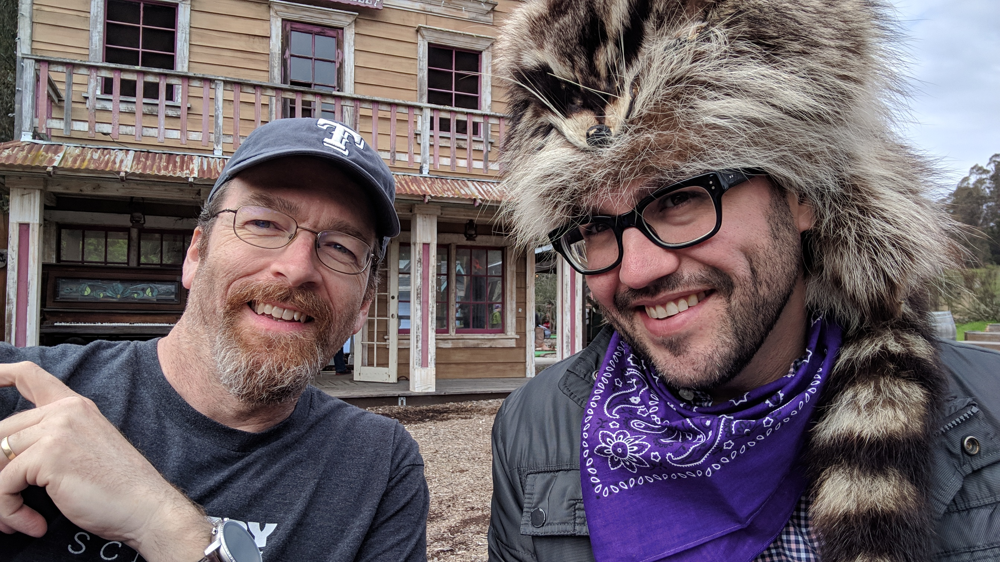

## Chris Morris: Dir. of Engineering

.center.two-big[]

---

.center[]

---

.center[]

---

.center.one-big[<a href="https://mysterydoug.com" target="_blank">mysterydoug.com</a>]

---

# CodePen.io

- <a href="https://codepen.io/chrisgannon/pen/JVVMpv" target="_blank">Penguin Stretching</a>
- <a href="https://codepen.io/Hornebom/pen/YMJKNv" target="_blank">Useless Machine</a>
- <a href="https://codepen.io/robdimarzo/pen/LMOLer" target="_blank">Solar System</a>
- <a href="https://codepen.io/YusukeNakaya/pen/LvePgj" target="_blank">StarFOX</a>
- <a href="https://codepen.io/shubniggurath/pen/eoyjwe" target="_blank">CSS Cloud Donut</a>
- <a href="https://codepen.io/rafaelcastrocouto/pen/wZJXjd" target="_blank">Black Hole</a>
- <a href="https://codepen.io/yuanchuan/pen/wZJqNK" target="_blank">Floating Heart</a>

---

# PluralSight

.center.one-big[<a href="https://www.pluralsight.com/courses/teaching-kids-basic-html" target="_blank">Teaching Kids Basic HTML</a>]