layout: false
class: center, middle

???

TODO: 
- Disable OS notifications.
- Shut down other apps.
- Reload, then Clone (`c` shortcut).
- Adjust the presenter notes font size. 

Before I get going, given the current state of things with the internet these
days, concerns about privacy and folks struggling to have control over their
own information, I just need to say this: everything I’m about to say is off
the record.

---

class: center, middle

.center[]

???

Greetings, my name is Chris Morris - I’m the director of engineering for
Mystery Science - NOT Theater 3000 - nerds

WE make awesome science videos and activities for elementary age kids. 

If you wanna come help save the next generation’s brains, come join us.

5 years ago, on this very spot, in Portland, I gave a lightning talk on
Impostor Syndrome. I've returned today, 5 years in the future, to talk about
something completely different.

---

class: center, middle

.center[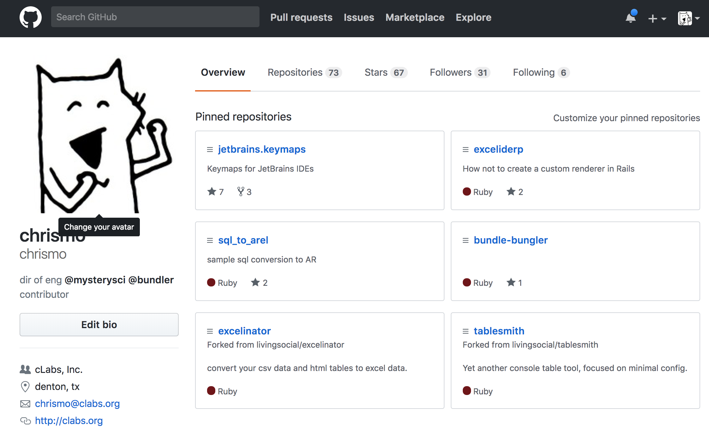] 

???

This is my profile on GitHub. I’m not showing this to you to brag about the
huge number of repos I’ve forked and never done anything with, nor is it to
share my joy over it being the only online service where I’ve been able to
obtain my preferred login name without having to resort to creativity.

---

class: center, middle

.center[]

???

Like *CLICK* this.

---

class: center, middle

.center[]

???

Or *CLICK* this.

---

.center[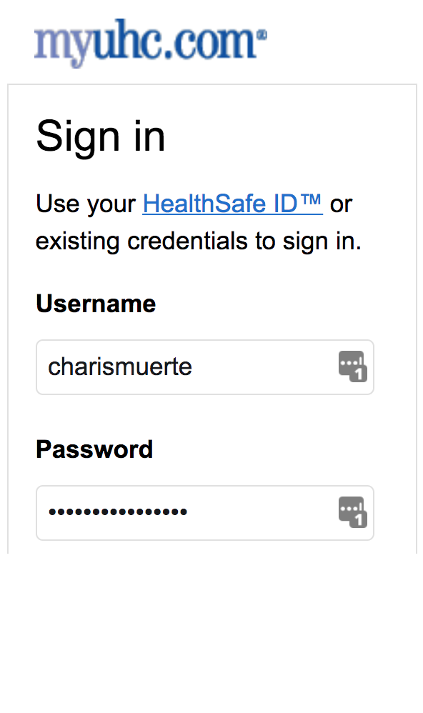]

???

But to pay tribute to Why the Lucky Stiff  

---

class: center, middle

.center[]

???

But to pay tribute to Why the Lucky Stiff
with my avatar of a cartoon fox that he drew, and I might be in copyright
violation of.

---

class: center, middle

.center[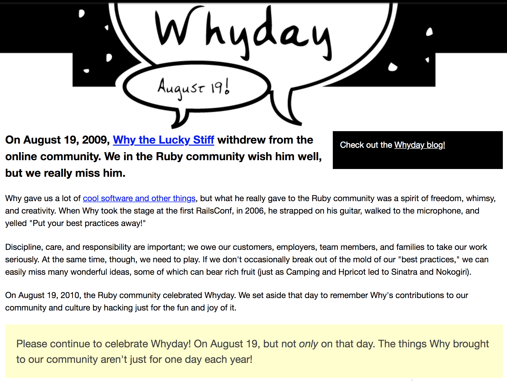]

???
 
7-and-a-half years ago, on the internet, my friend Glenn Vanderburg started 
this site whyday.org ... 

---

class: center, middle

.center[]

???

which today has clearly been taken over by a very lonely German.

---

class: center, middle

.center[]

???

Who's into sports betting on goats and Bingo.

---

class: center, middle

.center[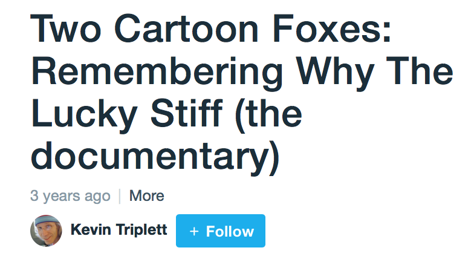]

???

5-and-a-half years ago, not on this very spot, at RubyConf, a wonderful
documentary on _why by Kevin Triplett was shown, but we don't have time to show
it, this is a lightning talk, I don't even have time to talk about the trailer,
so we'll just skip to the part

---

class: center, middle

.center[]

???

of the book
 
---

class: center, middle

.center[]

???

that why wrote
 
---

class: center, middle

.center[]

???

about Ruby
 
---

class: center, middle

.center[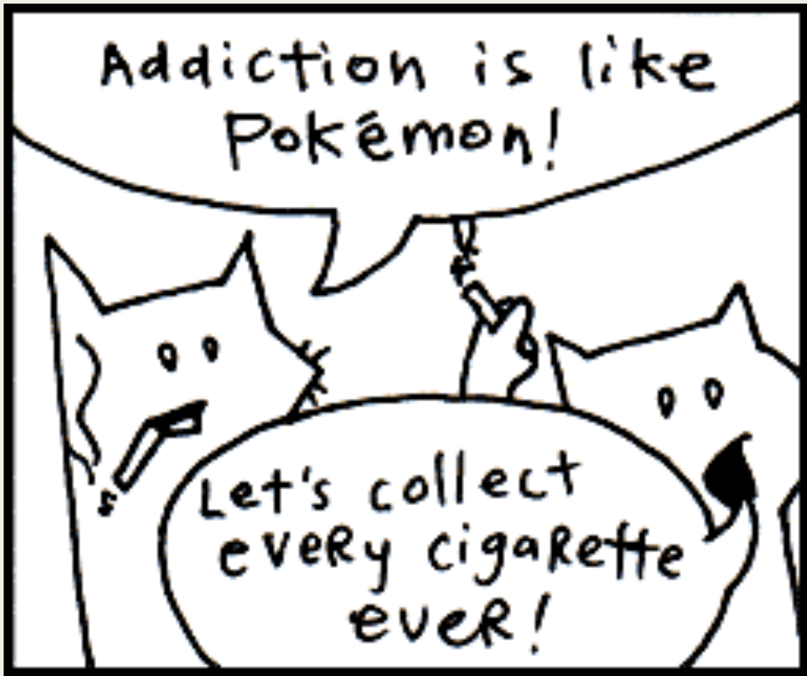]

???

where cartoon foxes show up
 
---

class: center, middle

.center[]

???

and start saying chunky bacon.

So ... who's into conspiracies? Don't raise your hands you fools! 
That's what they *want* you to do.

or y'all are lying and your refusal to participate is clearly a
conspiracy.
 
---

class: center, middle

.center[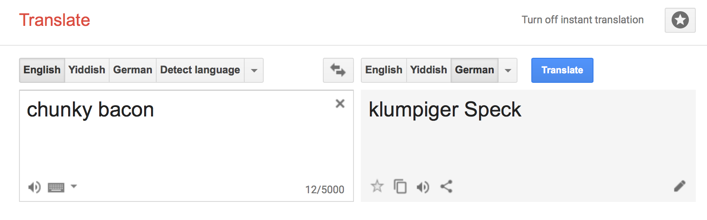]

???

If we translate "chunky bacon" into German and then BACK into English we get
our first clue.
 
---

class: center, middle

.center[]

???

“Lumpy bacon.” 

If we translate THAT into a “Y” language

---

class: center, middle

.center[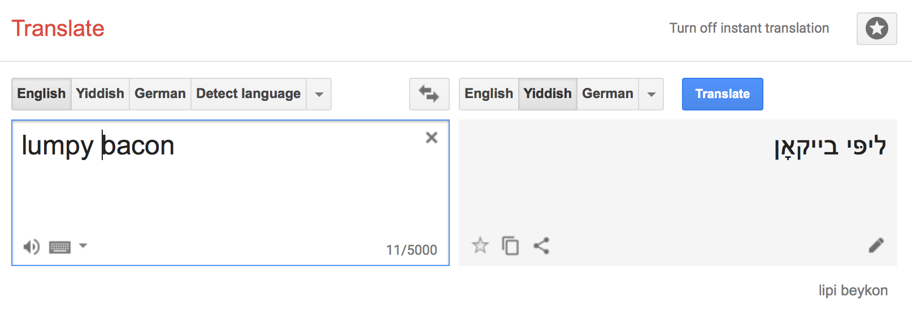]

???

Yiddish, for example, and then back. We get 
 
---

class: center, middle

.center[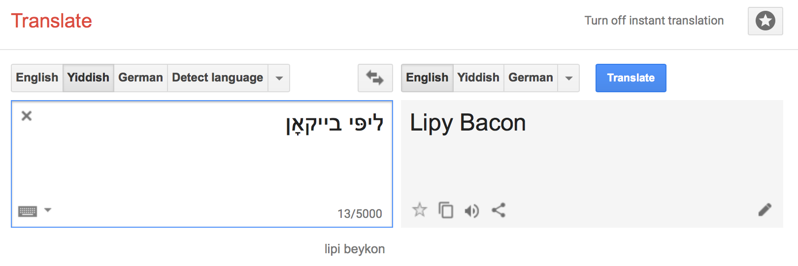]

???

“Lipy Bacon”.

Now ... .... I have no idea what that is - but LOOK AT THIS.

 
---

class: center, middle

.center[]

???

Did I mean “Lipsy Bacon” - Why, of course I meant that.

 
---

class: center, middle

.center[]

???

With a search on that, then an obvious connection through Ralph Lauren 
 
---

class: center, middle

.center[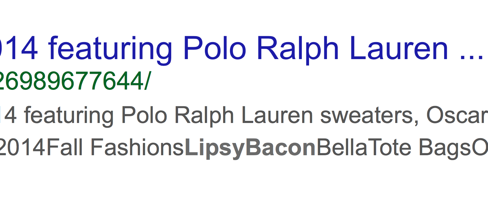]

???

we find a rare thing on the the internet - a PentaGooglewhack.

---

class: center, middle

.center[]

???

But not only that. A five-part term PentaGooglewhack. 

A meta-penta googlewhack.

We only have to scroll down on the page to see who is SPONSORING this insanity. 
 
---

class: center, middle

.center[]

???

That's right. Stitch Fix. A sponsor of this very conference.

And we know what this means.
 
---

class: center, middle

.center[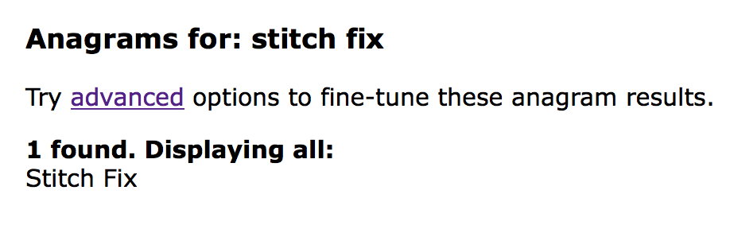]

???

Stitch Fix HAS NO ANAGRAMS. 

NONE.

I mean for crying out loud 
 
---

class: center, middle

.center[]

???

my own name has 43! Including such obvious ones as “Mr. Cirrhosis” 

 
---

class: center, middle

.center[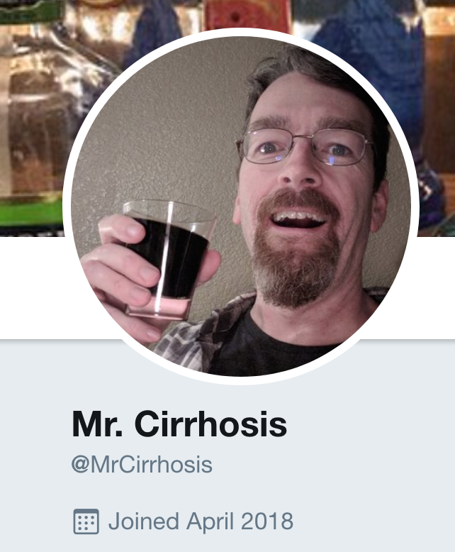]

???

hmmmmmm
 
---

class: center, middle

.center[]

???

How does Stitch Fix have zero?

That makes it an anagram prime. A prime-a-gram.

[BIG]: Which obviously means ... 

 
---

class: center, middle

.center[]

???

[fast]: I’ve started a cryptocurrency based on websites with
prime-a-gram domain names. 
 
---

class: center, middle

.center[]

???

Pizza.com is the only other one I’ve found so far.

BUT !!! 

if you join me in the hall after this you can get in on the ground floor.

 
---

class: center, middle

# MINSWAN

???

We in the Ruby community have this acronym. Who knows this one? 

What are you doing? You don't have a microphone, no one can hear you.

It means Matz Is Nice So We Are Nice.

Admittedly, except for me, I'm kind of being a jerk. 

But it's ok, I have Impostor Syndrome, so I'm not really a jerk.
 
---

class: center, middle

.center[]

???

If Matz is the father of our community, 

 
---

class: center, middle

.center[]

???

_why is clearly the guy who crashed your kid's bar mitzvah, but brought along
his DJ gear and saved YOUR chunky bacon after you showed up with an dead iPod
and left the charging cable back in Jersey.

 
---

class: center, middle

.center[]

???

We owe _why more than a site that's been devoured by lonely gambling addicted
Germans.

Seven years ago, this very day, if today were August 19th, I created a special
term in honor of whyday.

Now, like any good conspiracy, I've lied to you. I've tricked you. 

 
---

class: center, middle

.center[]

???

I told you Stitch Fix has no anagrams. It clearly has the number one there.
Correct? Programmers?!

---

class: center, middle

.center[]
.center[]

???

But there is a term that truly has NO anagrams, because it's pure nonsense.

And like any good developer, I registered that nonsense as a domain, and today 
am unveiling wicswac.org:

 
---

class: center, middle

.center[]

???

Why Is Chunky, So We Are Chunky.

What kind of bacon did the foxes want? Chunky. What’s special about Chunky?

 
---

class: center, middle

.center[]

???

It’s thick. 
 
---

class: center, middle

.center[]

???

It’s luxurious.
  
---

class: center, middle

.center[]

???

It’s ... generous.

So - ask yourself - What Would Why Do?

---

class: center, middle

.center[]

???

Like anyone could even know that.

 
---

class: center, middle

# you do you

???

You do you. Nobody wants skimpy bacon. Be generous. And
 
 
---

class: center, middle

.center[]

???

Be Chunky.
